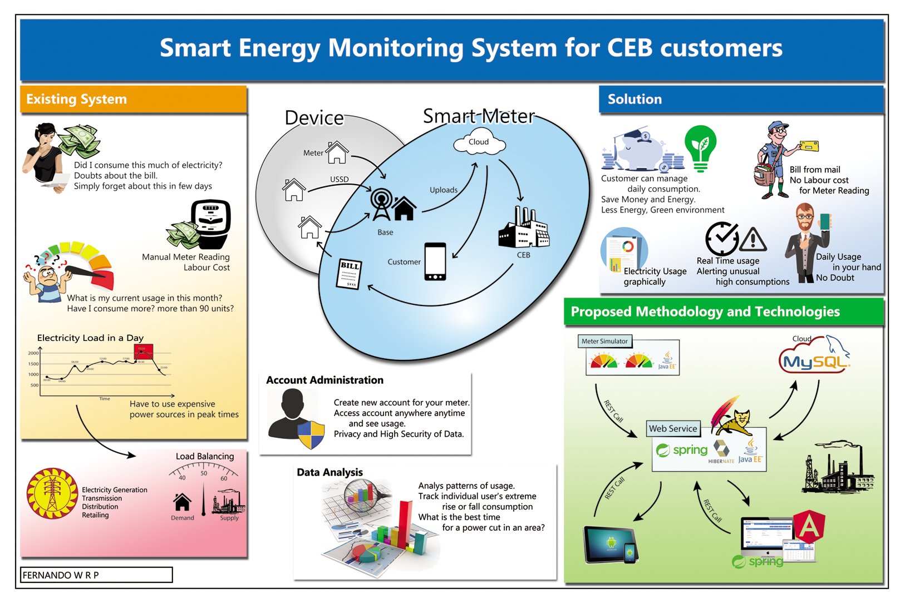

# Smart Meter
Smart Energy Monitoring System

Power consumers (users) cannot easily examine their consumption. It is very hard to manage their usage even when getting red bills with reminders.

## 1. Objective
The aim of the project is to make a green world, which is sustainable for many centuries with energy conservation, and make people’s life easy with managing expenditure for energy consumption.
- With letting electricity consumers to know their real-time and previous consumptions repeatedly to motivate them to reduce their electricity consumption.
- Let consumers to use less electricity in peak times (CEB generates more power using various power resources).
- Improve accuracy and speed of the process of billing.

## 2. Architecture
### 2.1 Components
Find source code repositories of each component from the link.

1. [Smart Meter Services](https://github.com/renuka-fernando/smart-meter-services/) - Micro Services of Smart-Meter
    - Account Service
    - Meter Reading Service
    - Payement Service
    - Gateway Service (Netflix Zuul Proxy)
    - Service Registry Service (Netflix Eureka Server)
1. [Smart Meter Web](https://github.com/renuka-fernando/smart-meter-web) - Web UI of Smart-Meter
1. [Smart Meter Readings Encrypts](https://github.com/renuka-fernando/smart-meter-reading-encrypts) - A programme to encrypt meter readings to manually call ***Meter Reading Service*** and add meter readings.
1. [Smart Meter Create Meter Readings](https://github.com/renuka-fernando/smart-meter-creating-readings) - Generate meter readings manually through its APIs and directly inserting to Data Base. This API can be used for demo purposes of the ***Smart Meter Services.***